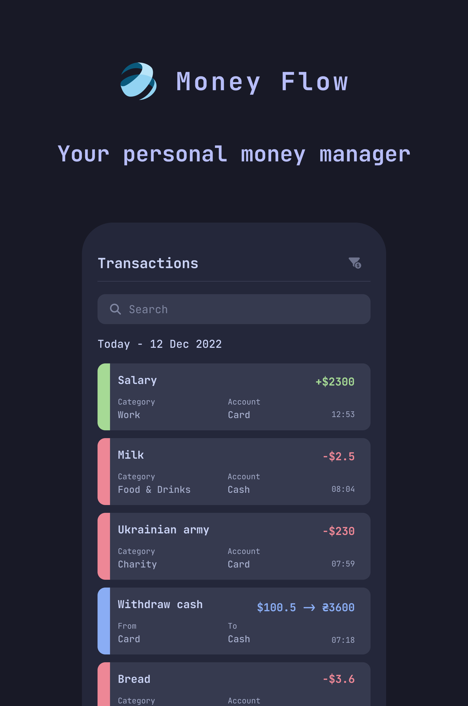
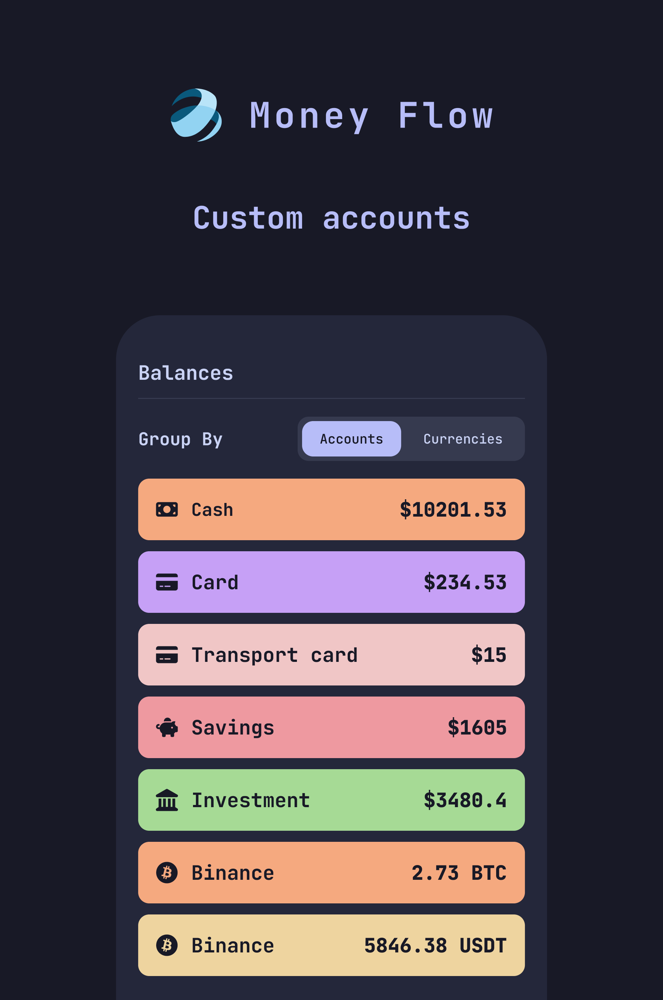
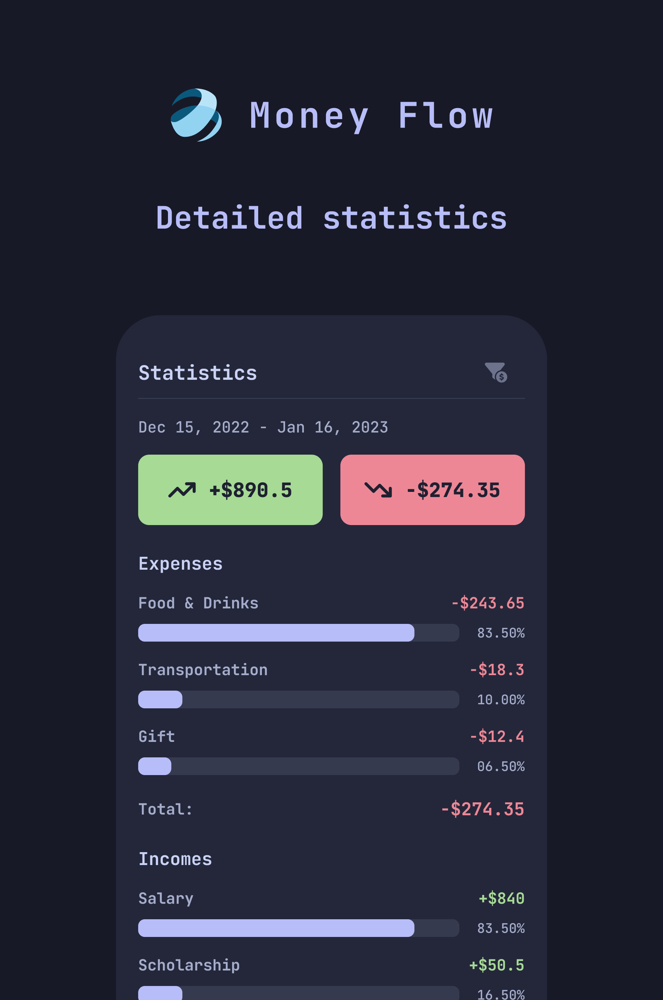
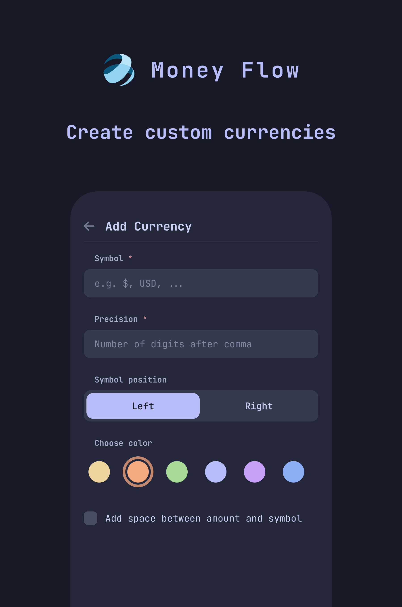
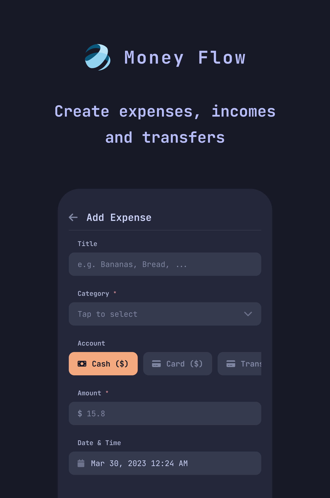
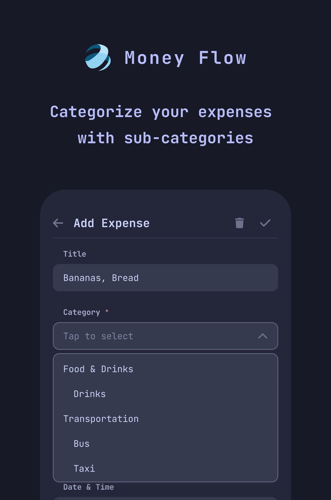

# Money Flow - your personal money manager

 

Our product is open source. You're welcome to contribute.

You can download the application from the [Google Play Store](https://play.google.com/store/apps/details?id=cash.moneyflow.moneyflow) or download the APK file directly from the [Releases](https://github.com/moneyflow-dev/moneyflow/releases/latest) page.

    
    
    

    
    
    

## Features

⚡ Manage your expenses, incomes and transfers between different accounts

⚡ Custom currencies

⚡ Custom accounts

⚡ Expense and income categories. An unlimited level of subcategories is supported

⚡ Statistics

⚡ Daily reminders. So you won't forget to record your transactions during the day

⚡ Backup to a file. You can backup all your data and not be afraid of losing it

⚡ Fully free and open source. You're welcome to contribute

⚡ No ads

⚡ Works offline. Your data will never leak to developers

## Support

If you want to support our product, the best thing you can do is star this GitHub repository.
